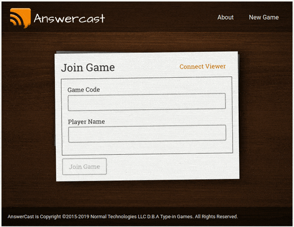

# AnswerCast

Play question and answer board games with your friends and a Google Cast device!

# Description

Answercast allows you and friends to play board games that require everyone to submit an answer, without
having to use pen and paper!

Instead of writing down answers on paper, everyone submits their answers using a smart phone or tablet.
Then the answers are scrambled and revealed on each device.
Connect any other device with a screen as a Viewer so you can project the results to an entire room.

It’s the perfect companion for games such as “The Game of Things” or “Loaded Questions” and many others.

Board games known to be enhanced by the usage of this app:

-  "The Game of Things" by Parker Brothers
-  "Loaded Questions" by All Things Equal, Inc
-  "Balderdash" by Mattel
-  Fictionary / The Dictionary Game
-  "Dictionary Dabble" by Patch
-  "Flummoxed" by Lagoon Games
-  "Wise and Otherwise" by WiseandOtherwise.com Inc

# Background

Several years ago I wrote this as two native apps, for Android (Java) and iOS (Objective-C), and leveraging a Google Cast
device to mediate and display the game. However, for years I have wanted to redo this as a pure web-app utilizing modern
web technologies so that it works on any device. When I learned about Phoenix Live View, I knew it was the perfect
technology to use for this new version.

Enjoy!

# Phoenix Phrenzy

This is my entry in [Phoenix Phrenzy](https://phoenixphrenzy.com),
showing off what [Phoenix](https://phoenixframework.org/)
and [LiveView](https://github.com/phoenixframework/phoenix_live_view) can do.

